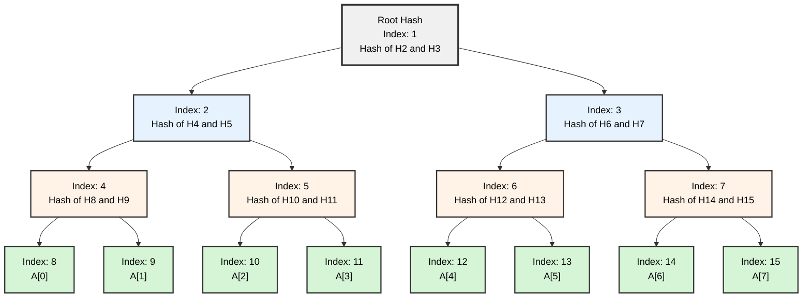
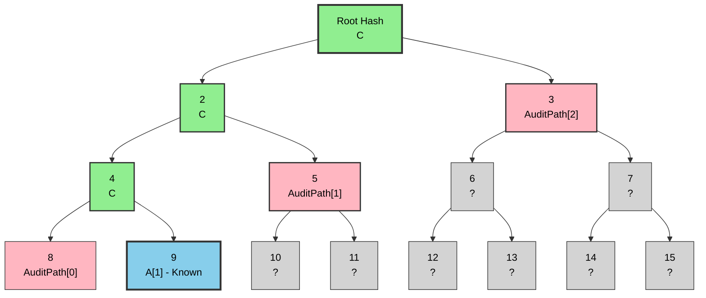

+++
date = '2025-05-03T21:40:39+05:30'
name = 'Utkarsh Sharma'
title = "Set Membership Proofs for Contiguous Elements"
+++

# Set Membership Proofs for Contiguous Elements

Set Membership proofs allow one to prove that an element exists within a set. There are many ways to do so, and the most well-known one is using Merkle Trees. But for proving contiguous elements of sets at once, I could not find anything on the topic. The construction of this was actually quite simple. In this blog/article, I will tell you about my thought process and the basic primitives for the constructions as well. So if you are familiar with all these things, please skip to [Root Computation](#root-computation-for-contiguous-array).

## Why?

I encountered this problem when I was wondering what to make for a hackathon in the cryptography track and came across one of the ideas given by zkemail about a privacy-preserving [whistleblowing](https://www.dni.gov/ICIG-Whistleblower/what-is.html#:~:text=WHAT%20IS%20WHISTLEBLOWING?,within%20IC%20programs%20and%20activities.) platform. The main motive of the platform was to have the whistleblower prove his claims without revealing his identity. Well, with a caveat that he must have an email backing his claim.

Now given the constraints of email, all that is to be done was to prove in zero knowledge that the whistleblower got an email from someone with email address `@_` and had some content that he claims to know. For example, you can imagine a scenario where you were fired wrongfully via an email which contains `you are fired because I hate you`.

The first problem was solved through [zk-email](https://prove.email/) which verifies that it is a valid email through [**DKIM Signature**](https://en.wikipedia.org/wiki/DomainKeys_Identified_Mail) verification in circom and extracts the *from* email address from the email header.

For the second problem, I need to prove in zero knowledge that the email body contained the claimed text which, if we convert the body and claimed content into an array of ASCII elements, boils down to proving in zero knowledge that a larger array contains a smaller array.

### A Simple Solution

Let's say we have an array $A$, then a contiguous set of elements are
$$S = \{A[i], A[i+1] ... A[i+c]\}$$ where $c$ is the length of the array and $i$ is the starting index, and in zero-knowledge (or in a circuit) we want to prove that $S$ is a subset of $A$.

So in pseudocode we just have to do:

```c++ {class="my-class" id="my-codeblock" lineNos=inline tabWidth=4}
    for ( index := 0..c) {
        assert S[i] == A[i + m] 
    }
```

This seems like a very trivial problem, but if we were to write this as a circom circuit, it would not work.

## Constraints of Writing Circuits in Circom

Circuits are a way of defining a computation in a zk-friendly way. Any computation that can be converted into a circuit can be proved in zero knowledge.


If you are familiar with ZK cryptography or have tried to dabble in it, you must have heard of the term *circuit*. Well, it's not a circuit *per se* as there are no currents or voltages involved, but here circuit is actually a short name for an arithmetic or boolean circuit. These are logical constructs made by mathematicians to define a formal language for any problem. The RareSkills ZK book is an excellent resource for understanding this.


The main problem is that it is not dynamic at all. From the **circom docs**:
> when constraints are generated in any block inside an if-then-else or loop statement, the condition cannot be unknown

An Unknown is basically a value that is input to the circuit or something that is dynamic. Thus, if we convert our pseudocode directly into circom with something like this:

```c++
template thisDoesNotWork(n,k){
    signal input big_arr[n];
    signal input small_arr[k];
    signal input starting_index;

    for(var i=0; i<k; i++){
        big_arr[starting_index + i] === small_arr[k];
    }
}
```

If we try to compile this code, we get the following error:

So as expected, this does not compile as the constraint becomes non-quadratic due to an unknown at compile time.

## Writing a Working Circuit

Even though circom sounds very painful to work with, there are logical workarounds. Control flow can be modeled via muxes, which are basically a circuit-level primitive for switch statements.

```c++ {lineNos=inline}
include "../node_modules/circomlib/circuits/comparators.circom";

template WorkingBasicCircuit(n,k){
    signal input big_arr[n];
    signal input small_arr[k];
    signal input starting_index;

    component is_equals[k][n]; 
    signal middle_constraint[k][n];

    for(var i=0; i<k; i++){
        for(var j = 0; j <n; j++){
            is_equals[i][j] = IsEqual();
            is_equals[i][j].in[0] <== j;
            is_equals[i][j].in[1] <== starting_index + i;
            middle_constraint[i][j] <== small_arr[i] * is_equals[i][j].out;
            big_arr[j] === middle_constraint[i][j] + big_arr[j] * (1 - is_equals[i][j].out);
        }
    }

}
```

The main logic of this code uses the `IsEqual` template. As the name suggests, it checks if the two input signals are equal; if they are equal, then the output signal is `1`, else it is `0`. So whenever in the inner loop `j == starting_index + i`, then `is_equals[i][j].out` becomes `1`, and in that case `big_arr[starting_index + i]` and `small_arr[i]` should be equal. We add `big_arr[j] * (1 - is_equals[i][j].out)` to maintain equality whenever `starting_index + i` and `j` are not equal, i.e., `is_equals[i][j]` is `0`.

Now this seems quite alright, but the number of constraints for this circuit with `n=1568` and `k=258` comes out to be a whopping **2,339,340** constraints (2.33M). Here is the build output:


Now that is actually not a lot, but we can almost **halve** the number of constraints, and if it's just proving membership, we get approximately **500k** constraints!

## Merkle Trees

A Merkle tree is a binary-tree data structure that follows a property that a parent node is the hash of its two children. Another important thing is a **Generalized Index**; a GI of a node is nothing but `2**index + y` where `y` is the height of the node and `index` is the position of the node from left (leftmost is index 0, then 1, and so on). A nice property for a *GI* is: say you are at index `k`, then the left child is `2*k` and the right child is `2*k + 1`. Here is an example to visualize it:



To prove that a node is in the leaf nodes you need to:

1. Verify that the Merkle tree was formed correctly, i.e., that the root was computed correctly.
2. Reconstruct the root from the [audit path](#audit-path) and the leaf node you require.

### Audit Path

An audit path is nothing but a set of siblings required to form the root. For example, say you want to prove that `A[1]` exists in the array. Then the audit path is the set of element indexes `{8, 5, 3}`. Here is a visual:



You can start with the blue node which is `A[1]`, compute the index `4` with index `8` from the audit path, and you basically do the same thing till you get the root, i.e., compute the parent from a known node which you computed and the sibling node from the audit path.

## Root Computation for Contiguous Array

<!-- Observation that my construction is based on Explain here how to construct the audit path how to generate root from this audit path -->
Let's say you want to prove elements from GI (Generalized Index) $K_1$ to $K_2$. You can compute all the hashes following a simple layer-by-layer algorithm:

1. If $K_1$ is odd, prepend to current layer the sibling from the audit path of $K_1$.
2. If $K_2$ is even, append to current layer the sibling from the audit path of $K_2$.
3. Hash the current layer to get the above layer.
4. Repeat the above steps: set the current layer to the new above layer. Set $K_1$ and $K_2$ to their parent index.

The image below is from a vibe-coded Merkle tree visualizer. You can see the span from index 30 to 50 that we are trying to prove. In blue are paths required for index 50 and in red for index 30.


The reasoning for this was a simple rule: to make a parent node, you need both nodes—left and right node. So if at any point the current layer starts from an odd index, you obviously need to make it even for computing the parent node, and the same logic applies if the layer ends in an even index.

One thing I have skipped over is how do you compute the audit path itself. You can see from the image that you are able to compute all nodes in the black boxes; anything outside the black box is in the audit path, and logically that will only be the leftmost and rightmost indices' paths. When the merged paths contain siblings, then remove them both as they can be formed from the elements below; `{2,3}` from the above example can be removed. In the above image, after reduction, the path will boil down to just `{{51}, {8,13}, {7}}`. A simple pseudo code is:

```python {lineNos=inline}
compute_audit_path(K1, K2, h):
    audit_path = [single_audit_path(K1), single_audit_path(K2)]
    for (i := 0..h):
        if (audit_path[i][0] + 1 == audit_path[i][1]):
            remove(audit_path[i][0])
            remove(audit_path[i][1])
```

The TypeScript code for finding the siblings and generating root is in [merkleTree.ts](https://github.com/0xnullifier/ZeroLeaks/blob/master/ui/src/lib/merkleTree.ts).

## Circuit for Root Generation
<!-- First I should explain that the circuit will not be so simple-->
The inspiration for this code was the circomlib SMT implementation. So in a similar fashion we move in a layer-by-layer manner. A high level diagram is given below; the numbering on each element is done in accordance with what part of the algorithm takes place there:


### Appending and Prepending an Array in Circom

One of the things you need to keep in mind when doing array work is that they are of fixed size that should be known at compile time. Thus, the size of each layer will be the same, which is called the `maxSize`. So we would have to keep track of the layer size with another layer. Here is a visual example of what it looks like:

<p align="center">
  
</p>

For handling the branching logic, we will use a `Mux2` which is a 4-input multiplexer with two select lines. The two conditions are *first index is odd* and *the second index is even*. The 4 outputs are:

| Case | Condition 1 (First Index Odd) | Condition 2 (Second Index Even) | Action |
|------|-------------------------------|----------------------------------|--------|
| 1 | False | False | Keep everything the same: `new_arr[i] = arr[i]` |
| 2 | True | False | Shift everything by 1: `new_arr[i] = arr[i-1]` |
| 3 | False | True | Keep array same and append: `new_arr[i] = arr[i]` and `new_arr[arrSize] = siblings[1]` |
| 4 | True | True | Shift by 1 and append: `new_arr[i] = arr[i-1]` and `new_arr[arrSize + 1] = siblings[1]` |

The code for the above logic is given below:

```c++ {lineNos=inline}
    component mux[maxSize - 1];
    // replacing the first element of the array with arr[0] if condition 1 is true
    component firstMux = Mux1();
    firstMux.c[0] <== arr[0];
    firstMux.c[1] <== siblings[0];
    firstMux.s <== condition[0];
    newArr[0] <== firstMux.out;

    component isEq[maxSize];
    signal appendSiblings[maxSize];
    signal arrSizeNotPrepended[maxSize];

    for (var i = 1; i < maxSize; i++) {

        // first we do some stuff for the append case
        // we need to append at `arrSize` or at `arrSize + 1` depending on condition 1
        // thus one input to the isEq is `i` and another is `arrSize` or `arrSize + 1`
        arrSizeNotPrepended[i] <== arrSize * (1 - condition[0]);
        isEq[i] = IsEqual();
        isEq[i].in[0] <== i;
        isEq[i].in[1] <== arrSizeNotPrepended[i] + (arrSize + 1)*condition[0];
        appendSiblings[i] <== isEq[i].out * siblings[1];

        mux[i - 1] = Mux2();
        // nothing happens 
        mux[i - 1].c[0] <== arr[i]; 
        // only condition one is true then `new_array[i]` is `arr[i-1]`
        mux[i - 1].c[1] <== arr[i-1];
        // if only condition two is true then `new_arr[i]` is `arr[i]` and
        // if `new_arr[arrSize] = siblings[1]`
        mux[i - 1].c[2] <== arr[i] * (1 - isEq[i].out) + appendSiblings[i];
        // if both conditions are true then `new_arr[i]` is `arr[i-1]` and 
        // if `new_arr[arrSize + 1] = siblings[1]`
        mux[i - 1].c[3] <== arr[i - 1] * (1 - isEq[i].out) + appendSiblings[i];

        mux[i - 1].s[0] <== condition[0];
        mux[i - 1].s[1] <== condition[1];

        newArr[i] <== mux[i - 1].out;
    }
    // the new size can be `arrSize` or `arrSize + 1` or `arrSize + 2`
    newSize <== arrSize + condition[0] + condition[1];
```

### Hashing the Layer

This is pretty simple; we just hash the new current layer, which gives us the new layer, and the new layer's size is just `newSize >> 1`. We iterate pairwise (indicated by `i += 2`) and set `aboveLayer` to the hash of its children from the current layer.

```c++ {lineNos=inline}
    component hashes[maxSize >> 1];

    component isLessThan[maxSize >> 1];

    for (var i = 0; i < maxSize; i += 2) {
        // i >> 1 is just the parent's index
        hashes[i >> 1] = Hash();

        isLessThan[i >> 1] = LessThan(nBits);
        isLessThan[i >> 1].in[0] <== i;
        isLessThan[i >> 1].in[1] <== addSiblings.newSize;

        hashes[i >> 1].left <== addSiblings.newArr[i] * isLessThan[i >> 1].out;
        hashes[i >> 1].right <== addSiblings.newArr[i + 1] * isLessThan[i >> 1].out;
        aboveLayer[i >> 1] <== hashes[i >> 1].hash * isLessThan[i >> 1].out;
    }
```

### Putting It All Together

Now we just need to put it all together; go layer by layer, updating the previous layer to the output of the LayerProcessor above:

```c++ {lineNos=inline}
template GenerateRoot(maxSegmentSize, height, nBits) {
    signal input continuousSegment[maxSegmentSize];
    signal input segmentSize;
    signal input auditPath[height][2];
    signal input firstGenIdx;
    signal input lastGenIdx;

    signal output root;
    
    signal currentLayer[height + 1][maxSegmentSize];
    signal layerSizes[height + 1];
    signal firstIndices[height + 1];
    signal lastIndices[height + 1];
    
    for (var i = 0; i < maxSegmentSize; i++) {
        currentLayer[height][i] <== continuousSegment[i];
    }

    layerSizes[height] <== segmentSize;
    firstIndices[height] <== firstGenIdx;
    lastIndices[height] <== lastGenIdx;
    
    component layers[height + 1];

    for (var y = height; y > 0; y--) {
        layers[y] = MerkleLayer(maxSegmentSize, nBits);
        layers[y].currentLayer <== currentLayer[y];
        layers[y].layerSize <== layerSizes[y];
        layers[y].siblings <== auditPath[y - 1];
        layers[y].firstIndex <== firstIndices[y];
        layers[y].lastIndex <== lastIndices[y];
        
        currentLayer[y - 1] <== layers[y].aboveLayer;
        layerSizes[y - 1] <== layers[y].aboveLayerSize;
        firstIndices[y - 1] <== layers[y].newFirstIndex;
        lastIndices[y - 1] <== layers[y].newLastIndex;

    }
    
    root <== currentLayer[0][0];
}

```

## Results Comparison

The trivial algorithm was 2.33M constraints, and the `GenerateRoot` template is only 533K constraints, which is over a 75% improvement. Though one thing more we have to do is verify that the root was computed correctly and that it had included the whole body of the email in the leaf nodes; the circuit for this is around 700K constraints. Thus, for the full circuit, it has 1.2M constraints, which is still a 50% improvement.

The circuit is available in the [ZeroLeaks repository](https://github.com/0xnullifier/ZeroLeaks/tree/master/circuits); you can run the test using `pnpm test`.

If you have any more doubts or want to chat, drop me a DM on [X](https://x.com/0xnullifier).
